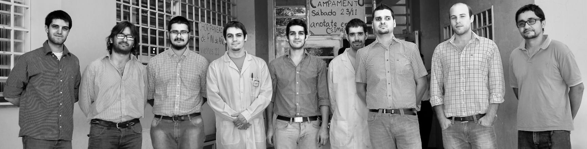

```{r setup, include=FALSE}
knitr::opts_chunk$set(echo = FALSE)
```


# yo

<!-- TUTORIAL en: https://rmarkdown.rstudio.com/revealjs_presentation_format -->

<!-- --------------------------  -->
<!-- PERSONAL  -->
<!-- --------------------------  -->


* Padre
* Docente
* Investigador

## contacto


| <pedro.perez@unc.edu.ar>
| <http://www.famaf.unc.edu.ar/~pperez1/>
| <http://liifamirx.famaf.unc.edu.ar/members/perez/>

## nosotrxs

| <http://liifamirx.famaf.unc.edu.ar>



## trabajo como físico
- docencia
- investigación
  - simulaciones monte carlo
  - medicina nuclear
  - imágenes de rx
- otros:
  - aplicaciones de imágenes de rx
  - radioprotección

<!-- --------------------------  -->
<!-- LIIFAMIR  -->
<!-- --------------------------  -->

# LIIFAMIR$^{\small x}$

## 

**Investigadores**

{width=60px style="border: none !important; vertical-align: middle;"} Mauro Valente, Físico

{width=60px style="border: none !important; vertical-align: middle;"} Pedro Pérez, Físico

{width=60px style="border: none !important; vertical-align: middle;"} Facundo Mattea, Químico

{width=60px style="border: none !important; vertical-align: middle;"} Marcelo Romero, Químico

--- 

**Doctorandos**

{width=60px style="border: none !important; vertical-align: middle;"} José Vedelago

{width=60px style="border: none !important; vertical-align: middle; background-color:none;"} Federico Geser

{width=60px style="border: none !important; vertical-align: middle;"} David Chacón

{width=60px style="border: none !important; vertical-align: middle;"} Sebastián Triviño

**Tesinista**

{width=60px style="border: none !important; vertical-align: middle;"} Larisa Fischer

## Líneas de investigación

**Imágenes de rayos X**
<small>
<ul style="list-style-type:none">
  <li>técnicas no convencionales</li>
  <li>tomografía y radiografía de alta resolución</li>
  <li>diseño y construcción de equipamiento</li>
</ul>
</small>

**Dosimetría**
<small>
<ul style="list-style-type:none">
  <li>geles de Fricke</li>
  <li>polímero de gel</li>
  <li>nanopartículas de Au y Ag</li>
</ul>
</small>

**Física Computacional**
<small>
<ul style="list-style-type:none">
  <li>simulaciones Monte Carlo (PENELOPE, FLUKA, MCNP)</li>
  <li>protonterapia, neutronterapia, hadronterapia</li>
  <li>medicina nuclear</li>
</ul>
</small>

## Proyectos

**Dosimetría**
<small>
<ul style="list-style-type:none">
  <li><a href="https://www.sciencedirect.com/science/article/pii/S0969806X16304911">Refuerzo y detección online con nanopartículas de Au y Ag</a></li>
  <li><a href="https://aapm.onlinelibrary.wiley.com/doi/full/10.1120/jacmp.v17i4.5626">Desarrollo de dosímetros de gel Fricke para bajas dosis</a></li>
  <li><a href="https://www.sciencedirect.com/science/article/pii/S1350448716301202">Dosimetría 2D con geles poliméricos y de Fricke</a></li>
</ul>
</small>

**Imágenes RX**
<small>
<ul style="list-style-type:none">
  <li><a href="https://scielo.conicyt.cl/scielo.php?script=sci_abstract&pid=S0717-95022016000400010&lng=es&nrm=iso&tlng=en">Ensayos no destructivos en muestras blandas</a></li>
  <li>Estudio de capilares en muestras rocosas de yacimientos</li>
  <li>Control de calidad en muestras metalmecánicas</li>
</ul>
</small>

**Computacional**
<small>
<ul style="list-style-type:none">
  <li>Dosimetría online en protonterapia utilizando Boro</li>
  <li><a href="https://www.cosmosscholars.com/previous-issue-ijnmr/46-abstracts/ijnmr/593-abstract-beta-minus-emitters-dose-point-kernel-estimation-model-comprising-different-tissues-for-nuclear-medicine-dosimetry-applications">Desarrollo de software paciente-específico para medicina nuclear</a></li>
  <li><a href="https://www.sciencedirect.com/science/article/pii/S0969806X16301906?via%3Dihub">Dosimetría neutrónica</a></li>
</ul>
</small>

# Facilidades

## Laboratorios y procesamiento

- 2 laboratorios
  1. línea de 60 keV con microtomógrafo
  2. línea de 225 keV en construcción:
    - refuerzo de dosis con nanopartículas y monitoreo online
    - microtomografía de muestras "*duras*"
- 2 equipamientos de lectura de geles bidimensionales
- acceso a varios núcleos de procesamiento (Argentina y Chile)

## 

{height=200px style="border: none !important; vertical-align: middle;"}
{height=200px style="border: none !important; vertical-align: middle;"}
{height=200px style="border: none !important; vertical-align: middle;"}
{height=200px style="border: none !important; vertical-align: middle;"}
{height=200px style="border: none !important; vertical-align: middle;"}
{height=200px style="border: none !important; vertical-align: middle;"}
{height=200px style="border: none !important; vertical-align: middle;"}
{width=300px style="border: none !important; vertical-align: middle;"}
{width=300px style="border: none !important; vertical-align: middle;"}

## descarga slides

`te interesa alguno de nuestros trabajos?`
`descargá estas filminas y accedé!`

<https://github.com/pap84/charla-ceimaf-oct2018>

O escribinos!

## Gracias!

{height=300px style="border: none !important; vertical-align: middle;"}
{height=300px style="border: none !important; vertical-align: middle;"}
